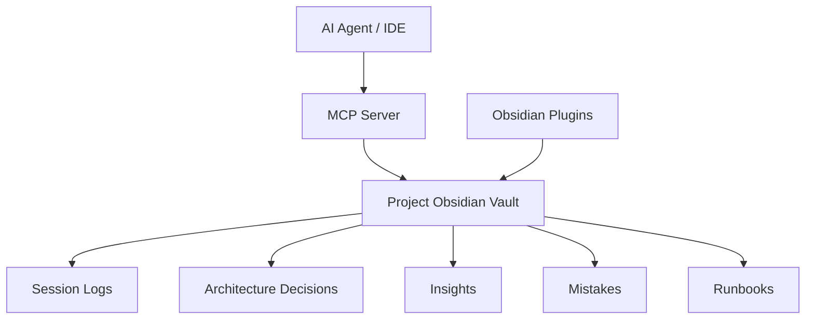

# Memory System Map

```mermaid
graph TD
  MCP[MCP Server] --> Vault[Project Obsidian Vault]
  Vault --> Sessions[Session Logs]
  Vault --> ADRs[Architecture Decisions]
  Vault --> Insights[Insights]
  Vault --> Mistakes[Mistakes]
  Vault --> Runbooks[Runbooks]
  Obsidian[Obsidian Plugins] --> Vault
  Agent[AI Agent / IDE] --> MCP
```
